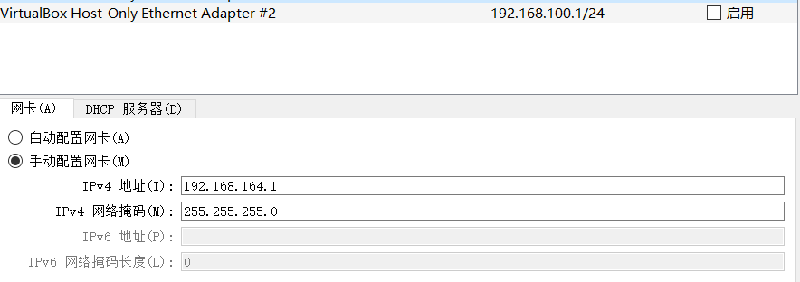
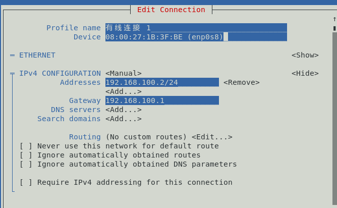
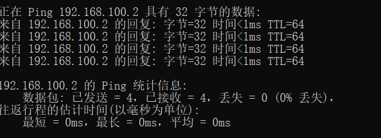
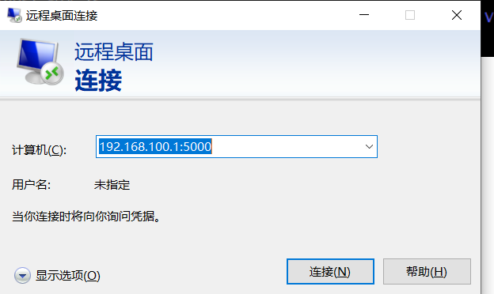
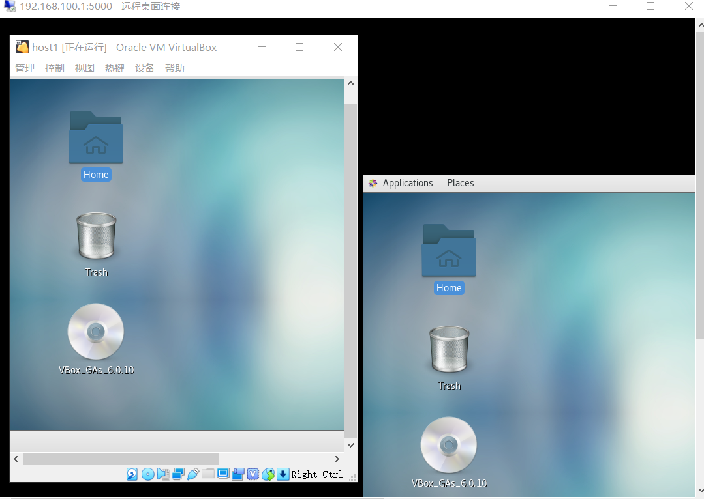

# 使用 VirtualBox 让 PC 提供云桌面服务

- [1、实验目的](https://pmlpml.github.io/ServiceComputingOnCloud/ex-install-cloud#1实验目的)
- [2、实验环境与要求](https://pmlpml.github.io/ServiceComputingOnCloud/ex-install-cloud#2实验环境与要求)
- [3、实验内容](https://pmlpml.github.io/ServiceComputingOnCloud/ex-install-cloud#3实验内容)
- [4、实验报告与作业要求](https://pmlpml.github.io/ServiceComputingOnCloud/ex-install-cloud#4实验报告与作业要求)

想到云计算、云平台，立马觉得高深莫测。如果你想搭建自己使用的桌面云，使用 VirtualBox 这样的开源软件，仅需要几十分钟或几个小时就能如你所愿。

Let’s Go！

## 1、实验目的

1. 初步了解虚拟化技术，理解云计算的相关概念
2. 理解系统工程师面临的困境
3. 理解自动化安装、管理（DevOps）在云应用中的重要性

 本实验需要一定的网络知识和系统方面经验，如无法独立完成，请积极与同学协作或到技术群咨询。

## 2、实验环境与要求

 实验需要硬件虚拟化（AMD-V 或 Intel-VT）支持，部分旧笔记本不支持。

- 用户通过互联网，使用微软远程桌面，远程访问你在PC机上创建的虚拟机
- 虚拟机操作系统 Centos，Ubuntu，或 你喜欢的 Linux 发行版，能使用 NAT 访问外网。

## 3、实验内容

 对于系统工程师最大的困扰就是复杂的硬件和软件环境。本实验原则上支持 MAC OS, Window, 或 Linux， 但是你会遇到各种各样的操作、配置和网络问题。目前还不能给你一个完整地、详尽地操作决解方案。

1. 安装 VirtualBox

   - 安装 Git 客户端（git bash），下载地址：[官网](https://git-scm.com/downloads/)，或 [gitfor windows](https://gitforwindows.org/) 或 [github desktop](https://desktop.github.com/)
   - 安装 Oracle VirtualBox 5.X，[官方下载](https://www.virtualbox.org/)
   - 配置 VirtualBox 虚拟机存储位置，避免找不到虚拟机存储位置，特别是消耗启动盘的宝贵空间
     - VirtualBox菜单 ：管理 -> 全局设定，常规页面
   - 创建虚拟机内部虚拟网络，使得 Vbox 内部虚拟机可以通过它，实现虚拟机之间、虚拟机与主机的通讯
     - VirtualBox菜单 ：管理 -> 主机网络管理器，创建一块虚拟网卡，网址分配：192.168.100.1/24
     - 在主机 windows 命令行窗口输入 `ipconfig` 就可以看到 `VirtualBox Host-Only Network #?:` 的网卡

2. 创建Linux虚拟机（以 CentoOS 为案例）

   - 下载 Linux 发行版镜像。

     - 如果是 [Centos](https://www.centos.org/download/)，仅需要 **Minimal ISO**；如果是 Ubuntu 请下载桌面和服务器
     - 阿里云[OPSX 下载](https://opsx.alibaba.com/mirror)

   - 用 VBox 创建虚拟机。 虚拟机名称建议以 centos-xxx 或 ub-xxx 命名，

     如果向导不能创建 64 bit 虚拟机，请更换电脑!!!

     - 建议虚拟机CPU、内存采用默认。如果是桌面版，CPU建议数1-2，内存不低于2G
     - 显示，显存采用默认。如果是桌面版，显存越大越好
     - 存储，不低于30G。避免以后扩展难。
     - 网络，第一块网卡必须是 NAT；第二块网卡连接方式： Host-Only，接口就是前面创建的虚拟网卡

   - 安装 Base 虚拟机，例如 centos-base。 利用虚拟化软件提供的虚拟机复制功能，避免每次安装 OS 系统的痛苦

     - 按提示安装，直到完成
     - 升级 OS 系统内核
       - 获取 wget, `yum install wget`
       - 配置源 [163源](http://mirrors.163.com/.help/centos.html)、[阿里云源](https://opsx.alibaba.com/mirror)
       - 升级 OS内核， `yum update`
     - 检查网卡配置
       - 配置网络的UI界面 `nmtui`，配置第二块网卡地址
       - ping 主机，例如： `ping 192.168.100.1`
     - 退出并关闭虚拟机

   - 安装虚拟机

     - 点击 centos-base 选择复制，输入新虚拟机的名，注意必须 **选择重新初始化所有网卡的 MAC 地址**
     - 然后选 **链接复制**
     - 配置主机名和第二块网卡
       - 使用 `nmtui` 修改主机名和第二块网卡IP地址
       - 重启
       - 在主机上，应能 ping 到这个地址，且能通过 ssh 访问该虚拟机（windows 需启动 git bash）
     - 如果你使用 vim 或 emacs
       - 安装 vim 或 emacs
       - 安装 C++ 开发工具
     - 如果你使用 centos 桌面
       - 重新配置虚拟机 CPU，内存，显存
       - 启动虚拟机
       - 安装桌面 `yum groupinstall "GNOME Desktop"`
       - 设置启动目标为桌面 `ln -sf /lib/systemd/system/runlevel5.target /etc/systemd/system/default.target`
       - 重启
       - 安装 VirtualBox 增强功能
         - [VirtualBox虚拟机CentOS安装增强功能Guest Additions](https://www.jianshu.com/p/7c556c783bb2)
         - [How to Install Kernel Headers in CentOS 7](https://www.tecmint.com/install-kernel-headers-in-centos-7/)
       - 安装 Chrome 浏览器
         - [CentOS7 使用 yum 安装 chrome](https://blog.csdn.net/pmlpml/article/details/70953626)

3. 配置用远程桌面访问你的虚拟机

   - 参考：[如何设置VirtualBox虚拟机远程访问模式](https://www.jianshu.com/p/6f0f35fa2c4f)
   - 虚拟机无界面启动，用户即可通过网络，使用RDP客户端访问

以上一些操作内容仅适用宿主（hosted）为 window 10 环境，安装 CentOS 7 的操作。

一些可供参考的连接：

- [docker 集群网络规划与 VM 网络配置](https://blog.csdn.net/pmlpml/article/details/53786382)
- [VirtualBox 安装 Centos 7 笔记](https://blog.csdn.net/pmlpml/article/details/51534210)

嗯嗯，建一个虚拟机，自己上课用。如果资源富裕，租一个给你的同学。

## 4、实验报告与作业要求

**基本要求**：

1、完成私有云桌面的搭建。（该作业对网络知识有一定要求，请互相帮助或找师兄获得帮助）

**环境**

- Windows 10
- VirtualBox 6.0
- Centos Minimal ISO 7

首先安装好VirtualBox，然后在网络管理器设置一张虚拟网卡，此网卡用于连接虚拟主机与真实主机，使得真实主机能使用其服务。

如图第二张网卡为虚拟网卡，ip设为192.168.100.1，为主机虚拟网的ip

接着在VirtualBox上安装Centos虚拟机，使用yum update更新内核。
接着在Centos终端进入配置网络的UI界面 nmtui，配置第二块网卡地址。

将虚拟机的第二块网卡地址设为192.168.100.2，网关设为192.168.100.1，网关即为虚拟网卡的本机地址。

同时启动其连接。

此时在本机上测试ping 192.168.100.2的虚拟机的连通情况，发现可以成功连通。

接着使用git bash ssh 访问该虚拟机。在访问虚拟机前，首先要开启虚拟机的ssh服务。具体操作可参考这篇博客：

https://www.cnblogs.com/maowenqiang/articles/7729246.html

接着在主机上使用git bash ssh访问该虚拟机，访问成功。

最后来实现远程连接桌面访问。

首先要安装centos 桌面并配置VirtualBox

- 重新配置虚拟机 CPU，内存，显存
- 启动虚拟机
- 安装桌面 `yum groupinstall "GNOME Desktop"`
- 设置启动目标为桌面 `ln -sf /lib/systemd/system/runlevel5.target /etc/systemd/system/default.target`
- 输入`startx`可进入桌面
- 安装 VirtualBox 增强功能([如何设置VirtualBox虚拟机远程访问模式](https://www.jianshu.com/p/6f0f35fa2c4f))

接着在主机上进行远程登陆，成功进行远程登陆，结果如下：

**可选博客**：

帮助你的同学趟过各种“坑”。因为，如果写一篇博客，这个博客将非常长，这样博客太难读。

1、找的你同学组成一个组，形成一个系列的博客，每个人介绍其中一部分或一个方面
2、每个人有重点的选择其中某部分，详细介绍每一步操作。其他部分引用同学的博客