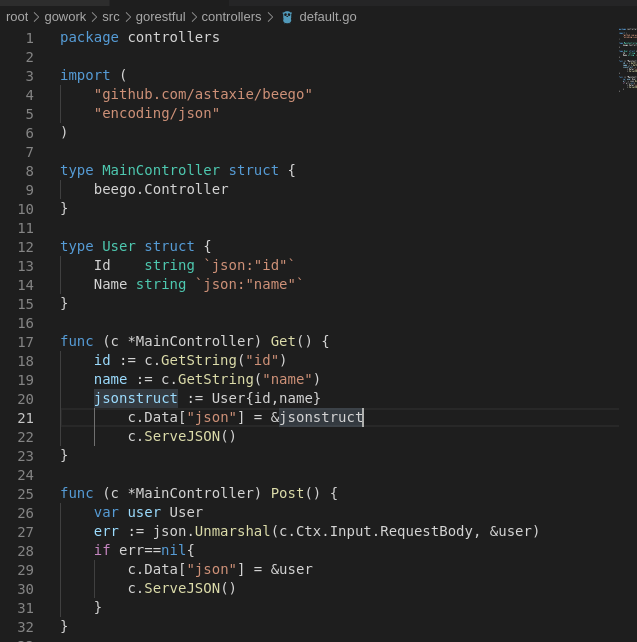
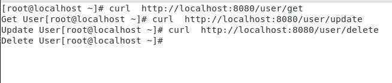
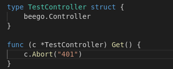

### 任务要求
模仿 Github，设计一个博客网站的 API

#### 实现
我们使用现在Go语言最火的Web服务框架之一**Beego**进行Web服务程序的编写。**Beego**提供了非常方便的路由自动匹配的功能以实现**Restful**接口。

首先安装**Beego**依赖和`bee`工具

```
go get github.com/astaxie/beego
go get github.com/beego/bee
```

然后在\$GOPATH\$/src目录下使用`bee new`创建**Beego**的新项目`gorestful`


参考**github [REST API v3](https://developer.github.com/v3/)** 实现RESTFUL接口


对于RESTFUL接口，其接口请求和返回的数据通信形式为JSON形式，同时时间戳应符合ISO 8601 format。对于Golang，其自带了**"encoding/json"**包，可以方便地将JSON数据与结构体进行转换，同时进行序列化和反序列化。Beego这里封装了json的实现，使得可以通过设置map的方式来返回json数据，无需显式指定使用json数据，更加方便。


请求的方式可以是get或者是post的形式，这里我们实现一个简单的接口去自动解析get和post的参数。

`https://localhost/api/`

与以上的方法相同，要构建包含不同输入和输出参数的接口，只需改动Json的接口十分方便。对于`get`接口方法只需要调用`GetString`或`GetInt`即可获得URL中的参数而无需手动解析URL中携带的Get参数。对于`Post`接口，要解析Post的接口数据，则需要调用`encoding/json`中的`Unmarshal`函数将json数据转为一个结构体。



使用Curl进行简单测试


可以发现**Beego**成功地解析了这些接口的`Get`和`Post`参数。

#### 接口和接口子操作URL的实现

如果我们要实现以下对User的有层次的`CURD`接口:
```
http://localhost:8080/user/get
http://localhost:8080/user/update
http://localhost:8080/user/delete
```

可以利用Beego的路由命名空间做树形URL解析。


使用curl进行测试，可以发现解析成功。




利用**Beego**的路由自动匹配实现以上的接口。

#### 层次参数URL

对于一些有层次要求的url接口，如博客网站的`articles/2000/1/1`这种带时间戳，把参数作为分段url的路由，可以使用Beego的AutoRouter对其进行解析。


这里在`routers.go`中新增`/articles/blog/:year/:month/:day`的新`url`路由路径


使用curl进行测试，可以看到日期url被成功自动路由成功解析并输出到Beego日志中


#### 错误处理

对于RESTFUL接口的异常处理，则可掉用**Abort**和**Redirect**函数实现返回错误码的功能。beego 框架默认支持 401、403、404、500、503 这几种错误的处理。用户也可以自定义相应的错误Handle来处理自定义的状态码。

这里简单地编写一个状态码接口来测试Beego的返回错误处理。




curl测试结果如下：

