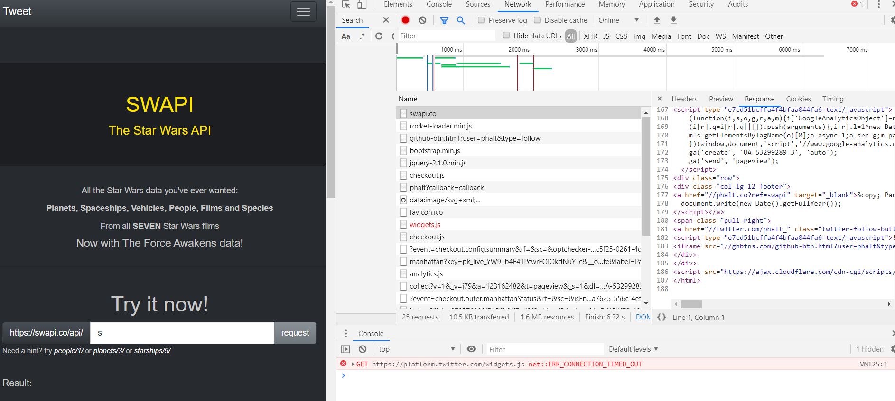
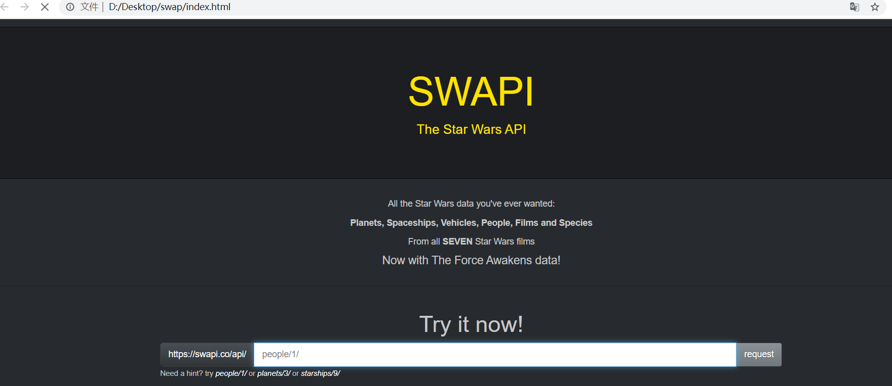
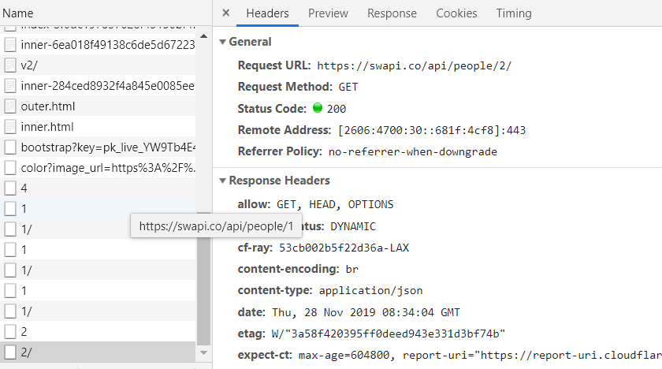
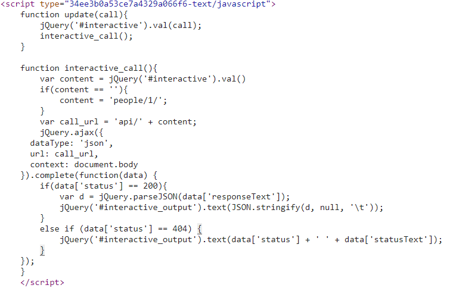
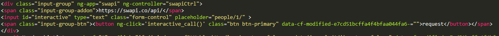
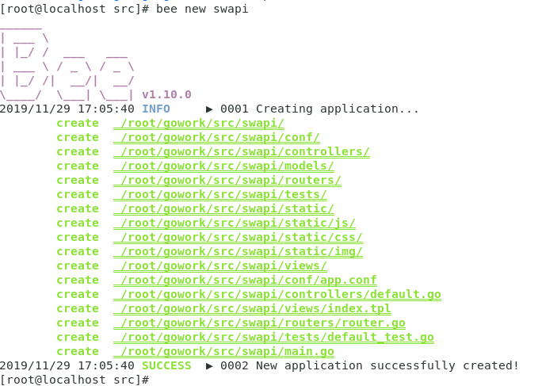
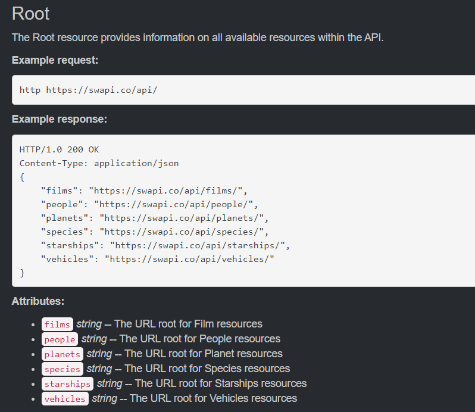
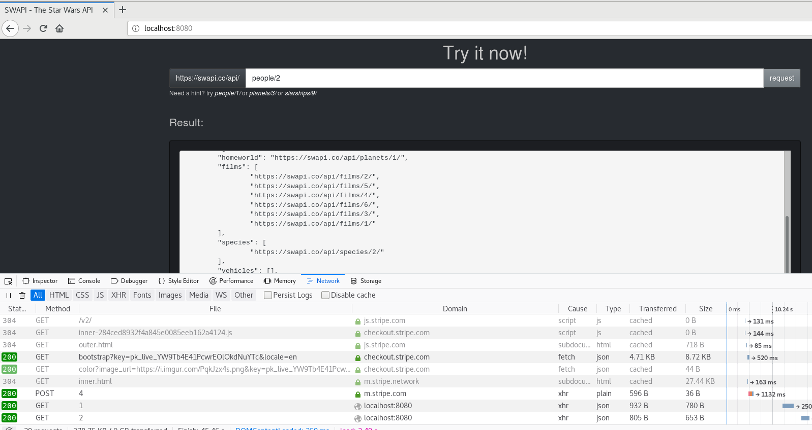

## 简单 web 服务与客户端开发实战

### 复制 https://swapi.co/ 网站

#### 运行

- 联网（有些js和请求是要联网的）
- 安装boltDB
- 安装beego 和 bee 工具

```shell
bee run
```


#### 前端实现

首先通过Chrome的开发者管理器视图观察该网站前端页面的结构。



复制其主要的html,css和js文件资源到本地运行测试。成功地在本地复制出了相同的界面。



接下来对原网站发起接口请求时发生的变化以及触发的对应的Event Listener进行观察。






可以发现其点击按钮请求时是简单地通过调用内嵌于html的`interactive_call`函数在后台使用ajax get请求从后端获得数据，然后将id为`interactive_output`的元素的text（即下方文本框显示出该元素），如果请求的api错误，则直接显示404 Error，非常的简单暴力。

这里使用angular.js的绑定机制对这个东西进行改写，使得脚本独立出html，让它不那么难看一点。



```js
var app = angular.module("swapi", []);
app.controller('swapiCtrl', function($scope,$http) {
    $scope.interactive_call = function(){
        var content = jQuery('#interactive').val()
        if(content == ''){
            content = 'people/1/';
        }
        var call_url = '/api/' + content;
        jQuery.ajax({
      dataType: 'json',
      url: call_url,
      context: document.body,
      success: function(data){
            var d = jQuery.parseJSON(data['responseText']);
            console.log(d)
            jQuery('#interactive_output').text(JSON.stringify(d, null, '\t'));
            
        },
       error: function(data){
       		jQuery('#interactive_output').text(data['status'] + ' ' + data['statusText']);
       }
    });
   }
});
```

#### 后端实现
其实后端就相当于实现以下类似的几种api
https://swapi.co/api/people
https://swapi.co/api/vehicle
https://swapi.co/api/planet

这里使用Golang作为后台开发语言，Beego作为后台开发框架，BoltDB作为后端数据库引擎。

#### 安装bolt

```powershell
go get github.com/boltdb/bolt
```

#### 安装Beego并创建项目

```shell
go get github.com/astaxie/beego
go get github.com/beego/bee
```

然后在\$GOPATH\$/src目录下使用`bee new`创建**Beego**的新项目`swapi`



#### 路由解析实现

`swapi.io`的路由有6个接口



使用Beego的路由解析编写6个路由控制器，一个api控制器作为主路由器。其他的子路由利用自动路由解析的方法进行解析。每个路由处理对应的接口与数据库交互。

比如对于url的`api/films/`，其由APIController的Films方法控制，实现如下：

>基本原理就是先检查参数数量是否正常，否则返回404。然后打开数据库的对应Film表，检查是否有对应的项，由于懒得写爬虫去爬swapi.co的数据，所以这里如果没有找到数据，则是直接向swapi.co发起对应的http的api请求，获得数据然后放在数据库里并返回，如果swapi.co没有该数据则返回404。这样下次请求就直接从数据库中拿出来就好了。其他的api的实现也是类似。

```go
func (c *APIController) Films() {
	params := c.Ctx.Input.Params()
	if (len(params)!=2){
		c.Abort("404")
		return
	}
    db, err := bolt.Open("swapi.db", 0600, nil)
    if err != nil {
        panic(err)
	}
	defer db.Close()
	first := true
	for k, v := range params {
		if (first){
			first = false
			continue
		}
		beego.Notice(k, v)
		//query
		err = db.Update(func(tx *bolt.Tx) error {
        b := tx.Bucket([]byte("Film"))
        //往表里面存储数据
        if b != nil {
			data := b.Get([]byte(v))
			if data!=nil{
				beego.Notice("Found in DataBase")
				c.Data["json"] = string(data)
				c.ServeJSON()
				return nil
			}else{
				url := "https://swapi.co/api/films/"+v
				client := http.Client{Timeout: 5 * time.Second}
				resp, err := client.Get(url)
				if (resp.StatusCode==404){
					c.Abort("404")
					return nil
				}
    			if err != nil {
        			panic(err)
    			}
    			defer resp.Body.Close()
    			var buffer [512]byte
    			result := bytes.NewBuffer(nil)
    			for {
        			n, err := resp.Body.Read(buffer[0:])
        			result.Write(buffer[0:n])
        			if err != nil && err == io.EOF {
            			break
     				} else if err != nil {
            			c.Abort("404")
        			}
				}
				err = b.Put([]byte(v),[]byte(result.String()))
            	if err != nil {
					panic(err)
            	}
				beego.Notice(result.String())
				c.Data["json"] = result.String()
				c.ServeJSON()
				return nil
			}
        }
		return nil
   	 	})
    	if err != nil {
        	panic(err)
		}
	}
}
```

然后的话就是把前面的前端资源一部分放在view文件夹在主控制器中返回，另一部分放在static文件夹中作为静态资源返回。

最后测试发现没有问题。




