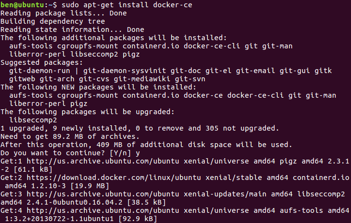

## 安装并运行Docker

### 安装Docker
- 环境：ubuntu 16.04 Desktop 64bit + Docker Community Edition

#### 配置 Docker 的 apt 源

##### 安装包，允许 apt 命令 HTTPS 访问 Docker 源。

```shell
$ sudo apt-get install apt-transport-https ca-certificates curl software-properties-common
```


##### 添加 Docker 官方的 GPG

```shell
$ curl -fsSL https://download.docker.com/linux/ubuntu/gpg | sudo apt-key add -
```


##### 将 Docker 的源添加到 /etc/apt/sources.list

```shell
$ sudo add-apt-repository \
  "deb [arch=amd64] https://download.docker.com/linux/ubuntu \
  $(lsb_release -cs) \
  stable"
```


#### 安装 Docker

```shell
$ sudo apt-get update
$ sudo apt-get install docker-ce
```




#### 镜像下载加速

由于Docker镜像服务器放在国外，下载时可能会很慢。所以先配置使用DaoCloud.io提供的免费的国内镜像服务并重启docker服务。


#### 运行 Docker

```shell
$ sudo docker run -d -p 80:80 httpd
```

1. 从 Docker Hub 下载 httpd 镜像。镜像中已经安装好了 Apache HTTP Server。
2. 启动 httpd 容器，并将容器的 80 端口映射到 host 的 80 端口。


访问localhost的80端口，发现Apache HTTP服务器已经成功启动


##### 查看Docker客户端命令


#####  查看Docker服务器状态


#### Docker启动过程


1. Docker 客户端执行 `docker run` 命令。
2. Docker daemon 发现本地没有 httpd 镜像。
3. daemon 从 Docker Hub 下载镜像(Pull)。
4. 下载完成，镜像 httpd 被保存到本地(Status)。
5. Docker daemon 启动容器(最后一行)。

##### 查看Docker本地的镜像


##### 查看Docker运行状态


##### 查看Docker内核运行

可以发现容器运行的系统内核和宿主系统的内核版本一致，所有容器都共用 host 的 kernel。


#### 创建Docker镜像

```shell
$ docker commit [container-id]
```

使用`commit`命令可以创建docker镜像，但是这并不推荐，因为这样创建的docker是黑箱，没有明确的创建步骤，也无法判定docker中是否含有恶意程序。

##### 使用dockfile创建docker镜像


## MYSQL 容器化
首先拉取MySql 5.7版本的容器


首先启动MySql服务器

```shell
$ sudo docker run -p 3306:3306 --name mysqlserve -e MYSQL_ROOT_PASSWORD=root -d mysql:5.7
```


然后启动 MySql服务器镜像，成功地进入mysql界面进行操作。

```shell
$ sudo docker run -it --net host mysql:5.7 "sh"
$# mysql -h127.0.0.1 -P3306 -uroot -proot
```


## 连接容器网络

创建一个容器桥接网络，网关为172.22.16.1，网段为172.22.16.0/24。


查看该桥接网络的具体信息


容器要使用新的网络，需要在启动时通过 `--network` 指定：

这里创建一个busybox的容器，并连接上面创建的网络


可以发现其ip和网关对应了上面创建的网络。

再创建另外一个相同的busybox容器


让上面的两个容器互ping。可以看到能相互ping通，说明两个容器成功连通。


