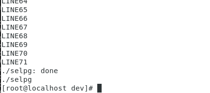
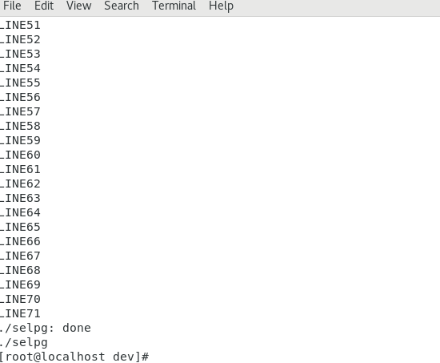
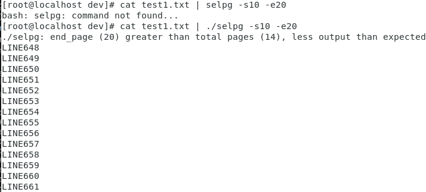
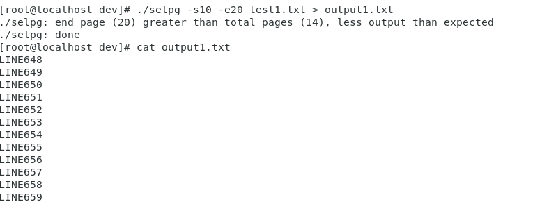
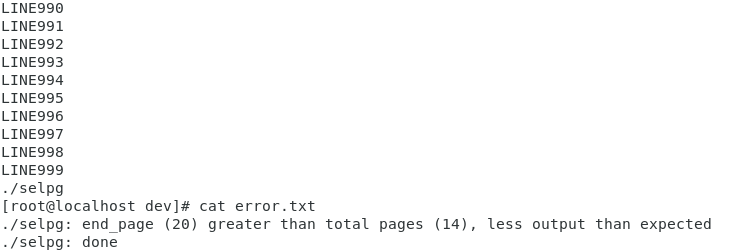
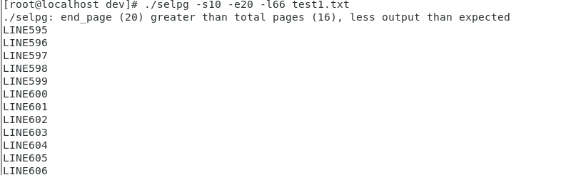
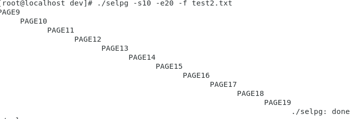
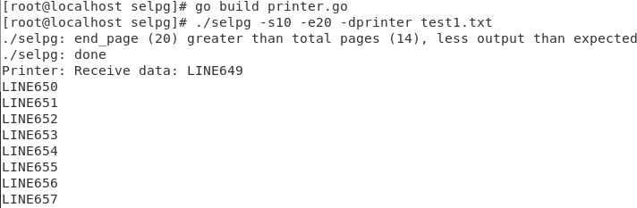
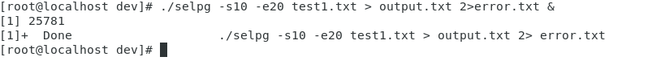

## 使用 golang 开发 [开发 Linux 命令行实用程序](https://www.ibm.com/developerworks/cn/linux/shell/clutil/index.html) 中的 **selpg**

### 实现

根据提供的[selpg.c](https://www.ibm.com/developerworks/cn/linux/shell/clutil/selpg.c)的selpg的C语言实现，可以将其改写为golang实现。

原selpg.c的实现分为两个部分

```C
process_args(ac, av, &sa);
process_input(sa);
```

process_args用于解析命令行参数,处理出错情况,将其信息保存到selpg_args结构中

```c
struct selpg_args
{
	int start_page;
	int end_page;
	char in_filename[BUFSIZ];
	int page_len; /* default value, can be overriden by "-l number" on command line */
	int page_type; /* 'l' for lines-delimited, 'f' for form-feed-delimited */
					/* default is 'l' */
	char print_dest[BUFSIZ];
};
```

golang实现大体遵循以上结构,但代码实现有几点不同

- golang使用的系统接口和selpg.c调用的系统接口不同，比如golang使用bufio代替原有C语言的缓冲区读写
- golang使用pflag来解析命令行参数,同时pflag代替系统自带的flag以支持 Unix 命令行规范, 而原来的selpc.c只是通过的获得main函数的argc argv参数来手动进行解析
- 由于没有打印机可供测试，所以这里实现了一个进程printer，-d参数使得输出通过管道向进程printer传递

#### 参数

- -s : 指定要抽取的页面范围的起始页

- -e ：指定要抽取的页面范围的结束页

- -l ：按行数打印页，默认一页行数为72

- -f ：按\f分隔符打印页

- -d ：指定打印的位置此实验用输出文件替代打印机，没有-d则默认将输出打印到终端
  

### 测试
确保已经安装了golang环境和pflag包

```shell
go get github.com/spf13/pflag
go test github.com/spf13/pflag
```

```shell
go build selpg.go
#将selpg文件夹放入go path的src中，这一步其实也可以省略，只不过后面没办法直接调用selpg命令
go install selpg
#然后cd进入相应目录中
```
**注意不能将selpg.go和print.go放在同一个文件夹中，因为go install selpg会失败（出现两个main模块）
selpg.go才是主文件，printer.go只是用于测试-d选项的，正确做法是将printer.go放在另外一个文件夹中，单独使用go build进行编译，然后将编译后的可执行程序放入selpg.go所在的文件夹中。**

```shell
$ selpg -s1 -e1 test1.txt
```



```shell
$selpg -s1 -e1 < test1.txt
```



```shell
$ other_command | selpg -s10 -e20
$ cat test1.txt | selpg -s10 -e20
```

这里用cat命令进行测试



这里成功的打印了10到14页，由于测试文件不到20页，所以selpg还提示less output than expected

```shell
$ selpg -s10 -e20 test1.txt >output1.txt
```



```shell
$ selpg -s10 -e20 test1.txt 2>error.txt
```

```shell
$ selpg -s10 -e20 test1.txt >output.txt 2>error.txt
```

```shell
$ selpg -s10 -e20 test1.txt >output.txt 2>/dev/null
```

```shell
$ selpg -s10 -e20 test1.txt >/dev/null
```
以上四条测试与前面的测试原理一致，故不赘述。

```shell
$ selpg -s10 -e20 input_file | other_command
```
```shell
$ selpg -s10 -e20 input_file 2>error_file | other_command
```

上面两条语句可以合并为1条测试，这里使用以下语句进行测试

```
$ selpg -s10 -e20 test.1.txt 2>error.txt | cat
```


除了成功的打印指定的页面范围外，通过管道利用cat显示出了输出，并且标准错误通过管道绑定到error.txt上

```shell
$ selpg -s10 -e20 -l66 test1.txt
```
加入l-66参数可以发现每页变为66行



```shell
$ selpg -s10 -e20 -f test2.txt
```
使用test2.txt（只含\f不含换行符来测试-f参数是否有效）



由于\f的缘故，可以看见输出的缩进，说明-f参数有效。

```shell
$ selpg -s10 -e20 -dprinter test1.txt
```


由于没有打印机，只能将-d指定的目标设为printer进程，可以发现标准错误成功地输出于标准输出，并且输出通过-d参数指定的文件通过管道输出到了printer进程中。

```shell
$ selpg -s10 -e20 test1.txt > output.txt 2>error.txt &
```

这个命令将selpg作为后台进程独立运行，可以观察到命令在后台成功运行。

