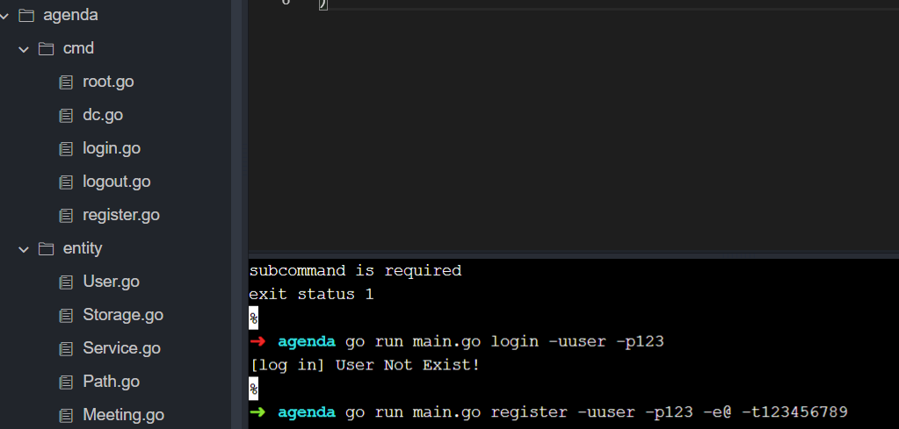
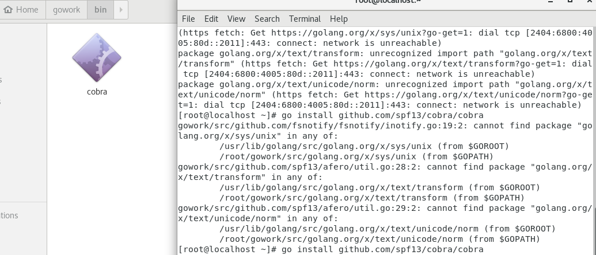
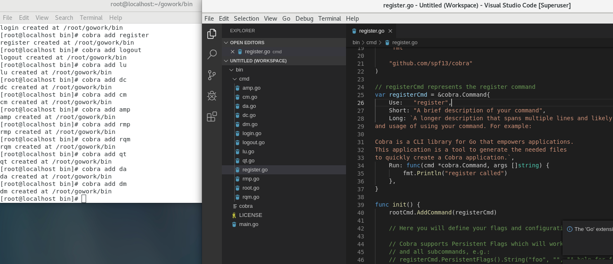
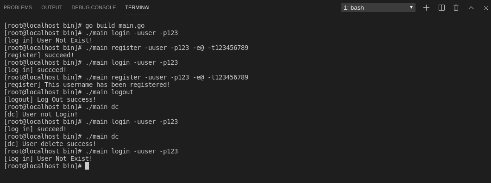
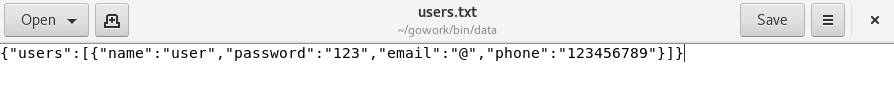

### Go Online部分运行结果



### 安装 cobra

```shell
go get -v github.com/spf13/cobra/cobra
```

在`$GOPATH/src/golang.org/x` 目录下用 `git clone` 下载 `sys` 和 `text` 项目，然后使用 `go install github.com/spf13/cobra/cobra`, 安装后在 `$GOBIN` 下出现了 cobra 可执行程序。



### 使用cobra生成器设计参数命令



使用`cobra init`初始化项目目录路径，`cobra add`为`cobra`的应用程序添加功能。可以发现`cobra`为每个增加的功能都添加了一个`.go`文件以供实现功能包括：

由于老师说**无需协作，一人实现几个功能就可以，所以这里实现了关于用户注册，用户登录，用户登出，用户删除的几个功能**

**用户注册**

1. 注册新用户时，用户需设置一个唯一的用户名和一个密码。另外，还需登记邮箱及电话信息。
2. 如果注册时提供的用户名已由其他用户使用，应反馈一个适当的出错信息；成功注册后，亦应反馈一个成功注册的信息。

**用户登录**

1. 用户使用用户名和密码登录 Agenda 系统。
2. 用户名和密码同时正确则登录成功并反馈一个成功登录的信息。否则，登录失败并反馈一个失败登录的信息。

**用户登出**

1. 已登录的用户登出系统后，只能使用用户注册和用户登录功能。

**用户删除**

1. 已登录的用户可以删除本用户账户（即销号）。
2. 操作成功，需反馈一个成功注销的信息；否则，反馈一个失败注销的信息。
3. 删除成功则退出系统登录状态。删除后，该用户账户不再存在。
4. 用户账户删除以后：
   - 以该用户为 发起者 的会议将被删除
   - 以该用户为 参与者 的会议将从 参与者 列表中移除该用户。若因此造成会议 参与者 人数为0，则会议也将被删除。

###  实现中的关键点和坑点

1.利用cobra的cmd包解析文件命令，调用service.go提供的服务接口进行操作。

2.service.go利用storage.go对储存的文件进行操作，storage.go利用golang的json库将用户和会议信息作为json字段储存在文件中。

3.curUser.txt文件记录了文件的登录状态，从而实现了不同状态下可操作功能的不同。

4.不同于面向对象编程语言的C++，golang其不同包之间的导出名（函数或变量）必须是大写开头的，造成了实现的复杂性。同时由于没有class类，所有的类方法都要写成结构体方法。json库中存在写出json为空但是数据没有问题且没有报错，后面发现是json写出的结构体的对应json字段必须是大写开头的，否则json库无法访问。

### 实验截图



