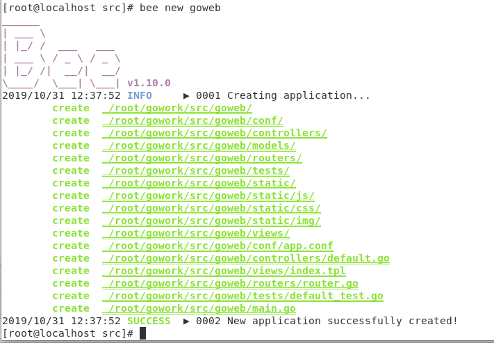
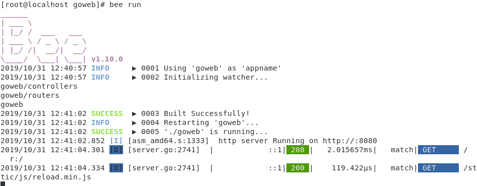
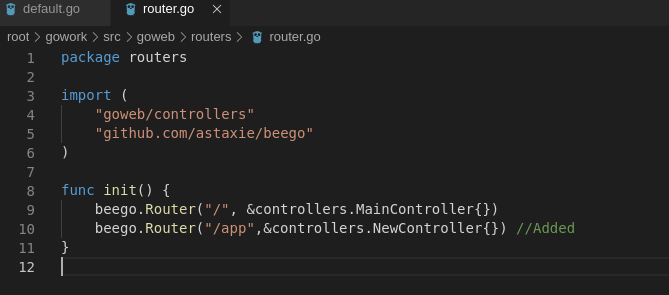
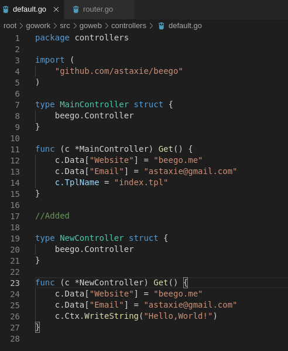
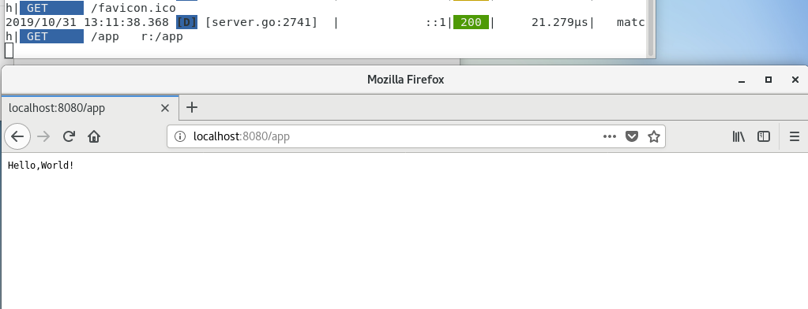
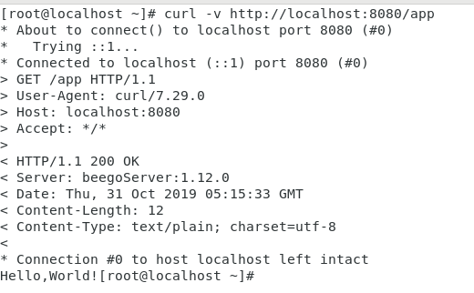
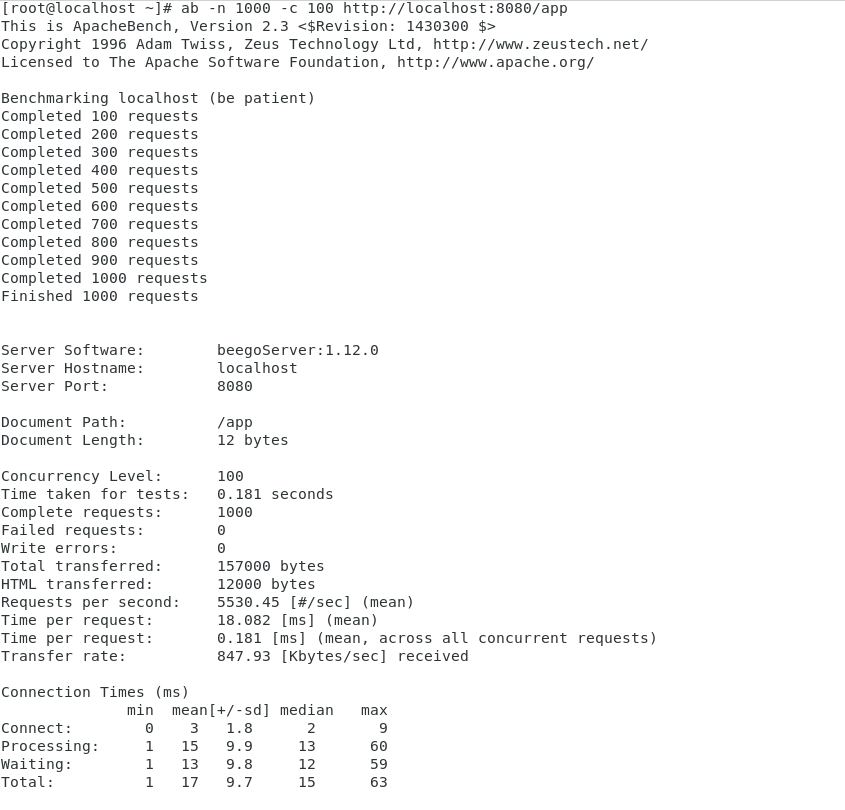

### 任务要求

**基本要求**

1. 编程 web 服务程序 类似 cloudgo 应用。
   - 要求有详细的注释
   - 是否使用框架、选哪个框架自己决定 请在 README.md 说明你决策的依据
2. 使用 curl 测试，将测试结果写入 README.md
3. 使用 ab 测试，将测试结果写入 README.md。并解释重要参数。

**扩展要求**

选择以下一个或多个任务，以博客的形式提交。

1. 选择 net/http 源码，通过源码分析、解释一些关键功能实现
2. 选择简单的库，如 mux 等，通过源码分析、解释它是如何实现扩展的原理，包括一些 golang 程序设计技巧。
3. 在 docker hub 申请账号，从 github 构建 cloudgo 的 docker 镜像，最后在 Amazon 云容器服务中部署。
   - 实现 Github - Travis CI - Docker hub - Amazon “不落地”云软件开发流水线
4. 其他 web 开发话题

### 编写web服务程序

我们使用现在Go语言最火的Web服务框架之一**Beego**进行Web服务程序的编写。

首先安装**Beego**依赖和`bee`工具

```
go get github.com/astaxie/beego
go get github.com/beego/bee
```

然后在\$GOPATH\$/src目录下使用`bee new`创建**Beego**的项目



利用`bee run`进行热编译运行。



然后访问[http://localhost:8080](http://localhost:8080/)，可以看到一个简单的demo app已经搭建成功。


接着我们修改其`url`接口，使其返回的相应内容为`“Hello,World!"`

这里在`routers.go`中新增`/app`的新`url`路由路径



接着在`controllers`模块中修改对应的路由控制器的`Get`方法，使其返回`“Hello,World!"`



此时访问`localhost:8080/app`可以发现成功获得了`Hello,World!`字符串



**使用curl进行测试**



**使用ab进行测试**

```
yum -y install httpd-tools
```



### 选择简单的库，如 mux 等，通过源码分析、解释它是如何实现扩展的原理，包括一些 golang 程序设计技巧。

mux是Golang的HTTP扩展库，从创建路由开始分析它是如何实现`HTTP`服务的

**路由创建**

mux的使用如下创建一个路由，并绑定一个HandleFunc控制器，最后调用http的ListenAndServe实现对指定端口的监听。

```go
func main() {
    r := mux.NewRouter()
    // Routes consist of a path and a handler function.
    r.HandleFunc("/", YourHandler)

    // Bind to a port and pass our router in
    log.Fatal(http.ListenAndServe(":8000", r))
}
```

**路由实现**

```go
func NewRouter() *Router {
	return &Router{namedRoutes: make(map[string]*Route), KeepContext: false}
}
```

NewRouter实际上返回了一个实例化的Router，Router的定义如下：

```go
type Router struct {
	// Configurable Handler to be used when no route matches.
	NotFoundHandler http.Handler

	// Configurable Handler to be used when the request method does not match the route.
	MethodNotAllowedHandler http.Handler

	// Parent route, if this is a subrouter.
	parent parentRoute
	// Routes to be matched, in order.
	routes []*Route
	// Routes by name for URL building.
	namedRoutes map[string]*Route
	// See Router.StrictSlash(). This defines the flag for new routes.
	strictSlash bool
	// See Router.SkipClean(). This defines the flag for new routes.
	skipClean bool
	// If true, do not clear the request context after handling the request.
	// This has no effect when go1.7+ is used, since the context is stored
	// on the request itself.
	KeepContext bool
	// see Router.UseEncodedPath(). This defines a flag for all routes.
	useEncodedPath bool
	// Slice of middlewares to be called after a match is found
	middlewares []middleware
}

// StrictSlash defines the trailing slash behavior for new routes. The initial
// value is false.
//
// When true, if the route path is "/path/", accessing "/path" will perform a redirect
// to the former and vice versa. In other words, your application will always
// see the path as specified in the route.
//
// When false, if the route path is "/path", accessing "/path/" will not match
// this route and vice versa.
func (r *Router) StrictSlash(value bool) *Router {
	r.strictSlash = value
	return r
}

// SkipClean defines the path cleaning behaviour for new routes. The initial
// value is false. Users should be careful about which routes are not cleaned
//
// When true, if the route path is "/path//to", it will remain with the double
// slash. This is helpful if you have a route like: /fetch/http://xkcd.com/534/
//
// When false, the path will be cleaned, so /fetch/http://xkcd.com/534/ will
// become /fetch/http/xkcd.com/534
func (r *Router) SkipClean(value bool) *Router {
	r.skipClean = value
	return r
}

// UseEncodedPath tells the router to match the encoded original path
// to the routes.
// For eg. "/path/foo%2Fbar/to" will match the path "/path/{var}/to".
//
// If not called, the router will match the unencoded path to the routes.
// For eg. "/path/foo%2Fbar/to" will match the path "/path/foo/bar/to"
func (r *Router) UseEncodedPath() *Router {
	r.useEncodedPath = true
	return r
}
```

router中实际上储存了Handler，是对应路由的控制器。StrictSlash用于匹配路径的斜杠问题。SkipClean用于清洗路由路径。HandleFunct为Route绑定对应的path和对应的Handler。

```go
func (r *Router) HandleFunc(path string, f func(http.ResponseWriter,
	*http.Request)) *Route {
	return r.NewRoute().Path(path).HandlerFunc(f)
}

func (r *Router) NewRoute() *Route {
	route := &Route{parent: r, strictSlash: r.strictSlash, skipClean: r.skipClean, useEncodedPath: r.useEncodedPath}
	r.routes = append(r.routes, route)
	return route
}

type Route struct {
	...
	// Request handler for the route.
	handler http.Handler
	// List of matchers.
	matchers []matcher
	// Manager for the variables from host and path.
	regexp *routeRegexpGroup
	...
}

func (r *Route) Path(tpl string) *Route {
	r.err = r.addRegexpMatcher(tpl, regexpTypePath)
	return r
```

ServeHTTP使用Match寻找对应匹配的路由，并用其绑定的handler进行处理。

```go
func (r *Router) ServeHTTP(w http.ResponseWriter, req *http.Request) {
	if !r.skipClean {
		path := req.URL.Path
		if r.useEncodedPath {
			path = req.URL.EscapedPath()
		}
		// Clean path to canonical form and redirect.
		if p := cleanPath(path); p != path {

			// Added 3 lines (Philip Schlump) - It was dropping the query string and #whatever from query.
			// This matches with fix in go 1.2 r.c. 4 for same problem.  Go Issue:
			// http://code.google.com/p/go/issues/detail?id=5252
			url := *req.URL
			url.Path = p
			p = url.String()

			w.Header().Set("Location", p)
			w.WriteHeader(http.StatusMovedPermanently)
			return
		}
	}
	var match RouteMatch
	var handler http.Handler
	if r.Match(req, &match) {
		handler = match.Handler
		req = setVars(req, match.Vars)
		req = setCurrentRoute(req, match.Route)
	}

	if handler == nil && match.MatchErr == ErrMethodMismatch {
		handler = methodNotAllowedHandler()
	}

	if handler == nil {
		handler = http.NotFoundHandler()
	}

	if !r.KeepContext {
		defer contextClear(req)
	}

	handler.ServeHTTP(w, req)
}
```

Match就是遍历routes找出匹配的route。
```go
// Match attempts to match the given request against the router's registered routes.
//
// If the request matches a route of this router or one of its subrouters the Route,
// Handler, and Vars fields of the the match argument are filled and this function
// returns true.
//
// If the request does not match any of this router's or its subrouters' routes
// then this function returns false. If available, a reason for the match failure
// will be filled in the match argument's MatchErr field. If the match failure type
// (eg: not found) has a registered handler, the handler is assigned to the Handler
// field of the match argument.
func (r *Router) Match(req *http.Request, match *RouteMatch) bool {
	for _, route := range r.routes {
		if route.Match(req, match) {
			// Build middleware chain if no error was found
			if match.MatchErr == nil {
				for i := len(r.middlewares) - 1; i >= 0; i-- {
					match.Handler = r.middlewares[i].Middleware(match.Handler)
				}
			}
			return true
		}
	}
```

**总结**

mutex实际上就是实现一个route数组保存不同的路径及其对应的Handle控制器，当收到路径请求时匹配到对应路径的Handle进行处理。

其使用的Go语言设计技巧是，路由的建立只需以`r.NewRoute().Path(path).HandlerFunc(f)`方式进行，嵌套返回的不同对象从而更方便地进行路由的设置。